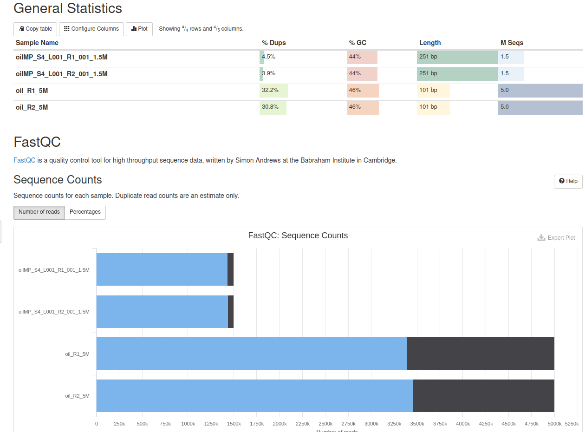
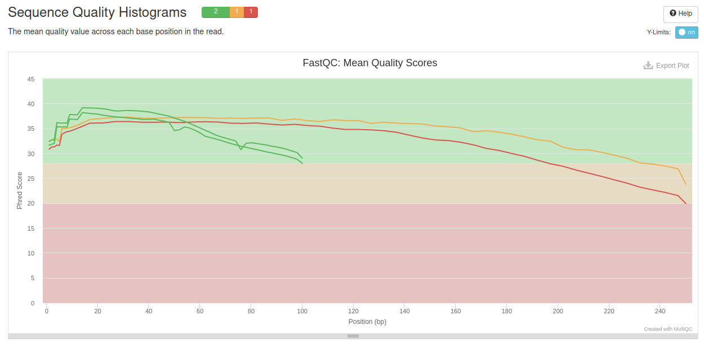
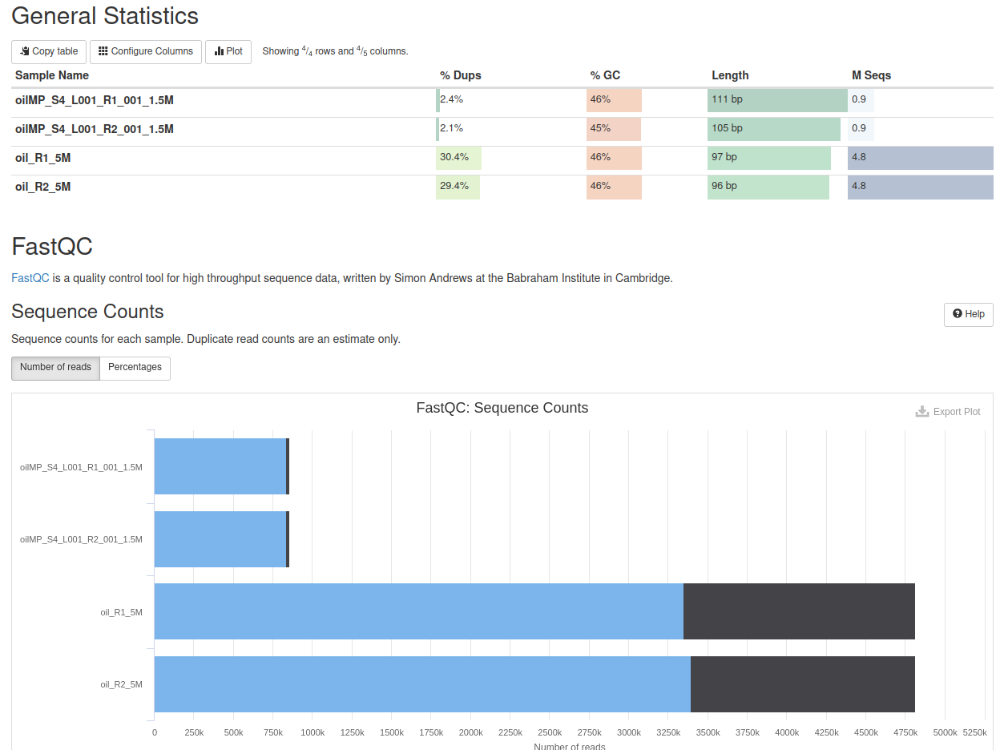
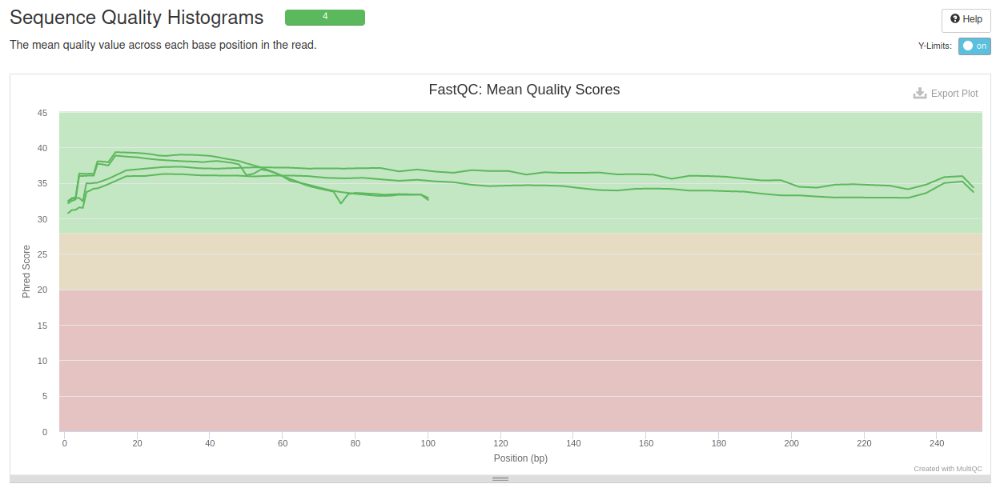

### Bacterial genome assembly

[This README in russian](README.ru.md)

This work with sequencing data of the paired-end and mate-pairs types was carried out on a server.  
In the case of paired-end, the files oil_R1.fastq and oil_R2.fastq were used (these are readings of the same DNA fragments from two sides).

Firstly, 5 million paired-end reads were randomly selected:

seqtk sample -s1231 oil_R1.fastq 5000000 > oil_R1_5M.fastq  
seqtk sample -s1231 oil_R2.fastq 5000000 > oil_R2_5M.fastq

as well as 1.5 million reads of the mate-pairs type:

seqtk sample -s1231 oilMP_S4_L001_R1_001.fastq 1500000 > oilMP_S4_L001_R1_001_1.5M.fastq  
seqtk sample -s1231 oilMP_S4_L001_R2_001.fastq 1500000 > oilMP_S4_L001_R2_001_1.5M.fastq

The quality of the reads was then assessed using fastqc:

fastqc oil_R1_5M.fastq  
fastqc oil_R2_5M.fastq  
fastqc oilMP_S4_L001_R1_001_1.5M.fastq  
fastqc oilMP_S4_L001_R2_001_1.5M.fastq

The command output was collected in the fastqc_after_seqtk folder.  
The multiqc command was used in this folder for four pairs of files:

multiqc -o multiqc fastqc_after_seqtk. 

Below are general statistics, but all files are in the fastqc folder.

Next, the primary files (but still processed by seqtk) were trimmed with the commands

platanus_trim oil_R1_5M.fastq oil_R2_5M.fastq  
platanus_internal_trim oilMP_S4_L001_R1_001_1.5M.fastq oilMP_S4_L001_R2_001_1.5M.fastq

For the received files oil_R1_5M.fastq.trimmed, oil_R2_5M.fastq.trimmed, oilMP_S4_L001_R1_001_1.5M.fastq.int_trimmed and oilMP_S4_L001_R2_001_1.5M.fastq.int_trimmed, fastqc and multiqc statistics were also calculated using similar commands

Based on the trimmed files, contigs were assembled:  
time platanus assemble -o Poil -t 2 -f trimmed_seqtk/oil_R1_5M.fastq.trimmed trimmed_seqtk/oil_R2_5M.fastq.trimmed 2> assemble.log

The resulting Poil_contig.fa file was analyzed by a short Python script (located in the src folder):  
Number of contigs: 606  
Assembled genome length: 3924795  
N50: 47611

Next, scaffolding was launched:  
time platanus scaffold -o Poil -t 2 -c Poil_contig.fa -IP1 trimmed_seqtk/oil_R1_5M.fastq.trimmed trimmed_seqtk/oil_R2_5M.fastq.trimmed -OP2 trimmed_seqtk/oilMP_S4_L001_R1_001_1.5M.fastq.int_trimmed trimmed_seqtk/oilMP_S4_L001_R2_001_1.5M.fastq.int_trimmed 2> scaffold.log

The resulting Poil_scaffold.fa file was also analyzed with a slightly modified program, yielding the following numbers:  
Number of contigs: 72  
Assembled genome length: 3873612  
N50: 3834915

For the resulting file, gaps consisting of nucleotides that were not recognized during sequencing were also reduced:  
time platanus gap_close -o Poil -t 1 -c Poil_scaffold.fa -IP1 trimmed_seqtk/oil_R1_5M.fastq.trimmed trimmed_seqtk/oil_R2_5M.fastq.trimmed -OP2 trimmed_seqtk/oilMP_S4_L001_R1_001_1.5M.fastq.int_trimmed trimmed_seqtk/oilMP_S4_L001_R2_001_1.5M.fastq.int_trimmed 2> gapclose.log  
The resulting file is uploaded to a data folder called scaffolds.fa.

All folders and files were downloaded from the server using commands like  
scp -r -P 32222 -i minor_key lndybovskiy@92.242.58.92:/home/lndybovskiy/HW1/fastqc_after_seqtk .

There was also written a program for the Poil_scaffold.fa file to count the number of gaps and unidentified nucleotides. There were 151 and 6030 of them, respectively. After compression by a team that removes gaps, there were 24 and 1295 of them, respectively.
