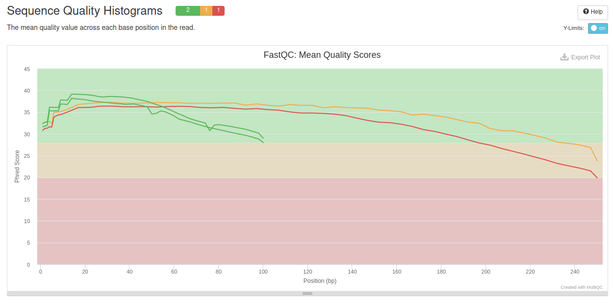

### Сборка генома бактерии

Работа с данными секвенирования типов paired-end и mate-pairs проводилась на сервере.
В случае paired-end использовались файлы oil_R1.fastq и oil_R2.fastq (чтения одних и тех же фрагментов ДНК с двух сторон).

Выбрали случайно 5 миллионов чтений типа paired-end:

seqtk sample -s1231 oil_R1.fastq 5000000 > oil_R1_5M.fastq
seqtk sample -s1231 oil_R2.fastq 5000000 > oil_R2_5M.fastq

и 1.5 миллиона чтений типа mate-pairs:

seqtk sample -s1231 oilMP_S4_L001_R1_001.fastq 1500000 > oilMP_S4_L001_R1_001_1.5M.fastq
seqtk sample -s1231 oilMP_S4_L001_R2_001.fastq 1500000 > oilMP_S4_L001_R2_001_1.5M.fastq

Оценили качество чтений с помощью fastqc:

fastqc oil_R1_5M.fastq
fastqc oil_R2_5M.fastq
fastqc oilMP_S4_L001_R1_001_1.5M.fastq
fastqc oilMP_S4_L001_R2_001_1.5M.fastq

Вывод команд был собран в папке fastqc_after_seqtk
Для четырёх пар файлов в этой папке была использована команда multiqc:

multiqc -o multiqc fastqc_after_seqtk. 

Ниже показана общая статистика, но все файлы есть в папке fastqc.

Далее исходные файлы (но все же обработанные seqtk) были обрезаны командами
platanus_trim oil_R1_5M.fastq oil_R2_5M.fastq
platanus_internal_trim oilMP_S4_L001_R1_001_1.5M.fastq oilMP_S4_L001_R2_001_1.5M.fastq

Для полученных файлов oil_R1_5M.fastq.trimmed, oil_R2_5M.fastq.trimmed, oilMP_S4_L001_R1_001_1.5M.fastq.int_trimmed и oilMP_S4_L001_R2_001_1.5M.fastq.int_trimmed была также посчитана статистика fastqc и multiqc абсолютно аналогичными командами

На основе обрезанных файлов была произведена сборка контигов:
time platanus assemble -o Poil -t 2 -f trimmed_seqtk/oil_R1_5M.fastq.trimmed trimmed_seqtk/oil_R2_5M.fastq.trimmed 2> assemble.log

Полученный файл Poil_contig.fa был проанализирован небольшим скриптом в питоне (приведён в папке src):
Число контигов:  606
Длина собранного генома:  3924795
N50:  47611

Далее был запущен скаффолдинг:
time platanus scaffold -o Poil -t 2 -c Poil_contig.fa -IP1 trimmed_seqtk/oil_R1_5M.fastq.trimmed trimmed_seqtk/oil_R2_5M.fastq.trimmed -OP2 trimmed_seqtk/oilMP_S4_L001_R1_001_1.5M.fastq.int_trimmed trimmed_seqtk/oilMP_S4_L001_R2_001_1.5M.fastq.int_trimmed 2> scaffold.log

Полученный файл Poil_scaffold.fa также был проанализирован слегка измененной программой с получением следующих чисел:
Число контигов:  72
Длина собранного генома:  3873612
N50:  3834915

Для полученного файла также было произведено уменьшение гэпов, состоящих из неузнанных при секвенировании нуклеотидов:
time platanus gap_close -o Poil -t 1 -c Poil_scaffold.fa -IP1 trimmed_seqtk/oil_R1_5M.fastq.trimmed trimmed_seqtk/oil_R2_5M.fastq.trimmed -OP2 trimmed_seqtk/oilMP_S4_L001_R1_001_1.5M.fastq.int_trimmed trimmed_seqtk/oilMP_S4_L001_R2_001_1.5M.fastq.int_trimmed 2> gapclose.log
Полученный в результате файл загружен в папку data под названием scaffolds.fa.

Все папки и файлы были скачаны с сервера командами вида
scp -r -P 32222 -i minor_key lndybovskiy@92.242.58.92:/home/lndybovskiy/HW1/fastqc_after_seqtk .

Для файла Poil_scaffold.fa была также написана программа, считающая число гэпов и неопознанных нуклеотидов. Их оказалось 151 и 6030 соответственно. После сжатия командой, удаляющей гэпы, их оказалось 24 и 1295 соответственно.
